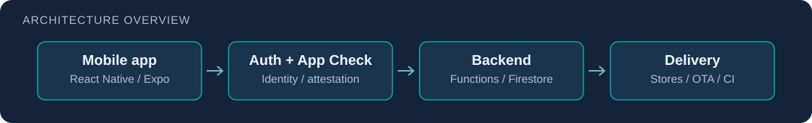

# PlanLi Travels

**A travel community and trip-planning product I designed, built, secured, and shipped to iOS and Android.**

[App Store](https://apps.apple.com/il/app/planli-travels/id6801453067) · [Google Play](https://play.google.com/store/apps/details?id=com.planli.planlitravels) · [Architecture](#architecture) · [Setup & operations](docs/OPERATIONS.md)

PlanLi helps travelers discover photo-based recommendations, organize destinations and trips, and share travel experiences. The repository contains the mobile app, Firebase backend, admin surface, security controls, tests, and release tooling. **Built end-to-end by Dor Cohen.**

## Engineering highlights

- **Product delivery:** Hebrew/RTL mobile UX, shared trip planning, community content, native store releases, and Expo OTA workflows.
- **Backend ownership:** authentication, server-side business writes, media processing, notifications, moderation, and destination workflows.
- **Application security:** private/public data boundaries, least-privilege Firestore/Storage rules, App Check, CodeQL, repository-specific Semgrep, and secret/dependency checks.
- **Verification and operation:** client/backend tests, Rules emulator checks, Sentry diagnostics, guarded migrations, and documented release verification.

The release record dated **30 September 2026** reports **1,004 client tests and 458 backend tests (three skipped)** plus Rules validation. These are historical counts; current release evidence and remaining checks are recorded in [operations](docs/OPERATIONS.md#current-environment-status).

## Architecture

**Stack:** React Native / Expo · TypeScript · Firebase Auth, Firestore and Storage · Node.js 22 Cloud Functions · GitHub Actions.

The client authenticates users and calls server-authorized business operations. Public content is separated from private user state; Functions coordinate content, media, notifications, and operational workflows. CI and release tooling validate changes before publication.

## Reviewer shortcut

| Area | Start here |
| --- | --- |
| Mobile product | [Client](client/) |
| Backend behavior and tests | [Functions](functions/) |
| Authorization | [Firestore rules](firestore.rules) and [Storage rules](storage.rules) |
| Delivery and security gates | [Workflows](.github/workflows/) and [Semgrep rules](.semgrep/) |
| Architecture and maintenance | [Documentation](docs/) |

## Current maintenance status

This summary reflects the existing operations record at the repository checkpoint reviewed on **6 October 2026**; it is not a fresh deployment verification.

- System recommendation ingestion is recorded as deployed on **2 October**; its trial had not yet run.
- The mobile profile/notification investigation opened on **1 October** remains recorded as open.
- Security stage 4 is recorded as deployed on **30 September**, with final verification still in progress.

Read the [current environment status](docs/OPERATIONS.md#current-environment-status) and the relevant later operational entries before maintenance or release work. A historical entry is not authority to repeat a deployment.

## Setup and maintainer guidance

The full setup, validation, environment, deployment, migration, release, and incident record is preserved in **[docs/OPERATIONS.md](docs/OPERATIONS.md)**. It retains the original detailed README content so operational history remains available without overwhelming this entry page.

Read [AGENTS.md](AGENTS.md) and the applicable client/backend guidance before changes. Use ignored local environment files and managed secrets. Production releases, migrations, and IAM changes require their own explicit authorization and focused checks.
